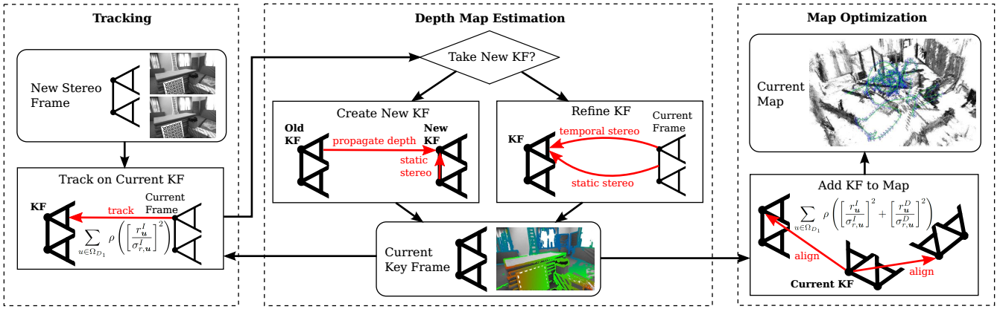

为了搞清楚双目与单目的主要区别，主要分析双目部分引入的变化。

记录stereo-LSD和stereo-DSO这两篇论文的一些改进方式。

<!--more-->

## stereo-LSD[^stereoLSD]

### LSD简介

LSD（Large-Scale Direct Monocular SLAM）的优化中没有关键点的深度，只优化关键帧的位姿。利用1个参考关键帧，每个新帧与参考关键帧进行track。track完成后对关键点的深度进行滤波（类似与高斯深度滤波，每个点维护了一个协方差 ）[^svo]，以此得到深度图。

所有关键帧进行sim(3)上的pose graph优化，LSD会在每个关键帧中提取一部分feature points用来回环检测。

[^stereoLSD]:Jakob Engel: Large-Scale Direct SLAM with Stereo Cameras (2015)
[^svo]: Jakob Engel: Semi-dense visual odometry for a monocularc amera (2013)

### 双目的加入

论文里提到两种多目相结合，达到既可以恢复尺度，又可以适应多种环境变化的效果：

- Static Stereo: 由固定的多目相机形成的双目
- Temporal Stereo: 由不同观测时刻形成的双目

双目相机的加入其实就是在LSD深度滤波时加入了双目，利用双目相机进行深度滤波能得到更好的深度估计值。另外，stereo-LSD中还混合使用了间接法中的几何残差进行联合优化。

另外，stereo-LSD优化时没有将左视图投影到右视图，论文说法是这样做实际上会降低精度，因为更大的基线长度导致直接法投影会有更多外点的误匹配。

> While one could choose to add photometric constraints to the new right image , we observed that this can decrease accuracy in practice: typically, the baseline from I1l to I2r is much larger than to I2l, leading to more outliers from occlusions and reflections.

## stereo-DSO[^stereoDSO]

### DSO简介

与LSD不同之处在于DSO（Direct Sparse Odometry）采用滑动窗口联合优化点的深度和关键帧的位姿，但是DSO中没有回环检测和位姿图的全局优化。

[^stereoDSO]: Rui Wang: Large-Scale Direct Sparse Visual Odometry with Stereo Cameras (2017)

### 双目的加入

与stereo-LSD相同的是，stereo-DSO中也同时使用static stereo和temporal stereo。由于双目相机的加入，初始化时不用采用随机深度，第一帧图像即可得到深度估计，加快了初始化的速度，但是对后续的tack部分没有做修改。

stereo-DSO在滑动窗口的优化方程中，加入了static stereo的误差项，并引入了一个权重$\lambda$，由上图可见，static stereo的残差数量明显比temporal stereo的少，论文中的实验将$\lambda$取为2。

另外，stereo-DSO有一些小改进：

- 双目的极线匹配采用3x5的NCC(normalized cross correlation)。
- 对新关键帧提取关键点时，不再采用正方形的划分区域，而是用与图像比例适应的区域，这样对于kitti这种图像长宽比例比较大的图像比较有利。

